# Mariano Gerardus Senduk

### Chasing useful intelligence across AI, systems, product, and strategy.

`Computer Science @ Universitas Indonesia` - `AI systems` - `Product engineering` - `Business strategy`

---

I am a Computer Science student at Universitas Indonesia, using projects as coordinates for a bigger direction: understanding how AI, software systems, product thinking, business, and self-development connect toward useful intelligence.

My north star is contributing to AGI by building systems that are reliable, understandable, and actually useful for people.

## Current Direction

- Connecting **AI research**, **software engineering**, **product strategy**, **business**, and **finance** into one long-term trajectory.
- Working on **Klaussa.com** as one active coordinate: legal AI, retrieval, agentic workflows, evaluation, and product-facing AI reliability.
- Turning coursework, competitions, and side projects into public artifacts that show how I think and build.
- Keeping a personal portfolio as a living atlas of projects, experiments, reflections, and direction.

## Things I Build

| Area | What I am exploring |
|---|---|
| **AI research** | Information retrieval, speech, computer vision, reinforcement learning, evaluation |
| **Software systems** | Web apps, APIs, CLI tools, mobile clients, infrastructure, maintainable code |
| **AI product** | RAG, legal AI, document workflows, user-facing AI reliability |
| **Product / project management** | Scope, planning, stakeholder communication, delivery, user flows |
| **Business / finance** | Forecasting, market research, dashboards, operations, strategic reasoning |
| **Creative software** | Portfolio design, games, custom tools, interaction concepts |

## Tech Constellation

**Languages**  

  
  
  
  
  

**AI / Data**  

  
  
  
  
  
  

**Web / Product**  

  
  
  
  
  
  
  

**Tools**  

  
  
  
  
  

## Featured Projects

| Project | Description | Focus |
|---|---|---|
| [**virus-outbreak-modeling-rl**](https://github.com/nano141004/virus-outbreak-modeling-rl) | Multi-city epidemic control policy modeled as an MDP and solved with reinforcement learning. | RL, MDP, policy modeling |
| [**exp-extend-list5**](https://github.com/nano141004/exp-extend-list5) | ListT5 inference extension on BEIR with grouping, candidate caching, and retrieval-quality analysis. | IR, reranking, evaluation |
| [**mini-search-engine**](https://github.com/nano141004/mini-search-engine) | Search engine built with indexing, compression, TF-IDF, BM25, WAND, LSI, and FAISS retrieval. | IR, search systems |
| [**CustomChessKell**](https://github.com/nano141004/CustomChessKell) | Mini functional-programming chess engine built in Haskell with custom movement logic. | Haskell, DSL, game logic |
| [**GameJam**](https://github.com/nano141004/GameJam) | Plaguewalker, an endless runner game inspired by the Google Dino game and built with Godot 4.3. | Godot, game dev |
| [**marianosenduk.app**](https://marianosenduk.app) | Responsive portfolio site for education, projects, skills, experience, and long-term direction. | Astro, portfolio, web |

## Most Used Languages

## Find Me

  
  
  

---

Still exploring. Still building. Still chasing the horizon.

